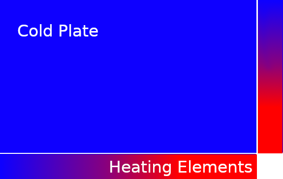
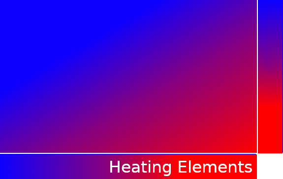

**Objectives:**
- Gain familiarity with synchronization primitives such as mutex locks and barriers.
- Learn to deal with common bugs in multithreaded programs.
- Practice thinking in terms of multiple threads which could be scheduled
in a variety of orders.

---

**Format:**

In this project, we have provided a program that uses synchronization primitives that need to be implemented in order for the program to execute correctly. This synchronization primitive is called a *barrier*.

---

**Barriers:**

A barrier is a common synchronization primitive. It allows a set of threads to stop at the
barrier and wait for each other until everyone has reached the barrier. Once each thread in the pool has reached the barrier, the barrier is
lifted, and the threads can continue executing along their path.

This is often useful in code scenarios where work within an iteration of a program is being parallelized. Each iteration step relies
on all of the input data being unchanged from the
previous iteration.
Threads should not continue on to future iterations while other threads are working on past iterations!

---

**Instructions:**

For this project, we provide a test application **barrer_test.c** (more details below),
and the interface for the barrier that the application uses. Barriers
implement two functions: an init function (`barrier_init`) and a wait
function (`barrier_wait`). They can have a variety of different
implementations.

`barrier_init` is responsible for initializing a given barrier. It takes a pointer to the `barrier_t` struct (defined in barrier.h) to initialize and an
integer `num_threads` corresponding to the number of threads. You are responsible for modifying the definition of `barrier_t` in barrier.h so that it can store all the data it needs to fulfill the required functionality. The barrier should be initialized to expect `num_threads` threads.

In order to register that it has reached the barrier, the thread calls `barrier_wait`, which should cause the thread to stop executing
until the specified number of threads are waiting. Once `num_threads` are waiting, the threads can all
pass the barrier and continue execution.

The `barrier_wait` function takes in a `barrier_t` corresponding to the barrier where the thread will wait.
If the number of threads waiting matches the required number, `barrier_wait` should release all threads, and the barrier should be reset so that it can be used again.

Barriers can encounter a variety of race conditions that can make them
really tricky to implement. We are not exposing your barrier
implementation to back-to-back uses of the same barrier, ie:
```
barrier_wait(&my_barrier);
~some work~
barrier_wait(&my_barrier);
```
Instead, we are using two separate barriers like so:
```
barrier_wait(&my_barrier1);
~some work~
barrier_wait(&my_barrier2);
```
This gives you some more freedom in your implementation and hopefully
makes it a little bit easier.

**NOTE**: Your barrier _**must**_ use `pthread_mutex_t` to stall and wakeup threads.
No other synchronization tools are allowed. The list of banned tools includes,
but is not limited to, condition variables and (of course) `pthread_barrier_t`.

---

**Barrier Test Program:**

It's not necessary for you to understand the program, but it provides an informative real-world scenario where these advanced primitives are a good fit.

The program being used to test your barrier implementation is an iterative solver for the heat equation, which you are likely to encounter if you study differential equations.
The initial setup is a metal plate with two heating elements along the top and right side.
In the beginning, the metal plate is uniformly initialized at 0 degrees celcius, but with the introduction of these heating elements,
the plate is no longer in equilibrium. 



Above is the initial state of our metal plate and heating elements.



Once the metal plate forms an  equilibrium with the heating elements, the heat distribution should look something like the image above.

We break the metal plate into a grid and store the temperature at each point of the
grid in an array. The temperature of each point in the next iteration is the average temperature of a grid point's neighbors
during the previous iteration. After many iterations, we finally reach a new equilibrium, and this is our solution.

The following code snippet is pseudocode for the serial (single-threaded) version of the solver, which will be used as ground-truth.
```
for each iteration:
    for each row:
        for each column:
            record the difference average of each grid point's neighbors and the current temperature
            
    for each row:
        for each column:
            update the temperature matrix to store the average previously computed
```

Notice how the second loop depends on data produced in the first loop. How does this affect us when we parallelize?
Let's consider some pseudocode for how a multithreaded program might execute this program. For this scenario, each
thread is responsible for computing the results for a fraction of the rows in our matrix.

```
my_row_begin := get_row_begin(my_thread_id)
my_row_end := get_row_end(my_thread_id)
for each iteration:
    for each row in [my_row_begin to my_row_end]:
        for each column:
            record the difference average of each grid point's neighbors and the current temperature
    for each row in [my_row_begin to my_row_end]:
        for each column:
            update the temperature matrix to store the average previously computed
```

What's the problem here? If a thread is running really fast and gets too far ahead of other threads, it might be working
on iteration 10, for instance, while the rest of the threads are running in iteration 8 (or even iteration 1!). Because the results
in each iteration are dependant on results produced in earlier iterations, our fast thread will be working with input
that hasn't been updated yet, yielding incorrect results. As well, even if all threads are on the same iteration, if
a thread is updating the matrix (ie executing in the 2nd loop) while another thread is executing the first for loop, that
thread might be using input for a future iteration in the current iteration, ALSO producing incorrect results.

So then how do we stop all of these threads from running away from each other? Barriers!
We have to ensure that all threads have completed the first for loop in its entirety before continuing on the second
for loop. We also must ensure that all threads have fully executed the second for loop before they continue on to the next
iteration. We can add calls to our barriers in the following locations to cause this behavior.

```
my_row_begin := get_row_begin(my_thread_id)
my_row_end := get_row_end(my_thread_id)
for each iteration:
    for each row in [my_row_begin to my_row_end]:
        for each column:
            record the difference average of each grid point's neighbors and the current temperature
    barrier_wait(barrier_1)
    for each row in [my_row_begin to my_row_end]:
        for each column:
            update the temperature matrix to store the average previously computed
    barrier_wait(barrier_2)
```

All threads will execute the first for loop and wait on `barrier_1` until all threads have called wait. At that time the
threads will resume execution and continue until they arrive at another barrier or exit.

---

**Local testing:**

Test your project on the test program *barrier_test* by running
```
./barrier_test <test_name_flag>
```
where `<test_name_flag>` is one of the following:
- `-sbt`: Runs the Single Use Barrier Test - this just runs 10 threads throught barrier once and makes sure they stop in and wait for each other in the expected way.
- `-brt`: Runs the Barrier Re-use Test - Do the same as the test above but between trial runs, use the same barrier. This should help verify that threads are resetting the barrier in the expected way.
- `-app`: Runs the Heat Plate Application Test - This is the test for testing full functionality of the barrier.
- `-all`: Runs all of the tests.

The program should terminate in just a few seconds, so if it is hanging
you should check for deadlock. If it terminates without printing, it
is working just fine.

You can also run the python tester, which should do the same thing and
report correctness in a nice format:
```
python3 test_main.py
```
---

**Submission:**

 - Submit your project on gradescope using the gitlab submission
   process.
 - The required files for submission are `barrier.c` and `barrier.h`.

***Team specific instructions*** 
  - Teams should only do one submission via group submission.
  - Teams must also edit the file called reflection.txt and include a detailed description of each team member's contributions to the project.
  
